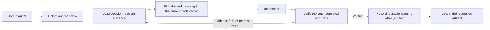

<p align="center">
  
</p>

<h1 align="center">Skill-Based Architecture</h1>

<p align="center"><strong>Make your coding agent follow the project's real rules, business meaning, and definition of done.</strong></p>

<p align="center">
  SBA turns scattered agent instructions into one routable, verifiable, maintainable project Skill.<br>
  SBA is a Skill, not an agent operating system, task database, or execution runtime.
</p>

<p align="center">
  <a href="#quick-start">Get started</a> ·
  <a href="examples/simple-repo/README.md">Try the safe demo</a> ·
  <a href="docs/sba-bible.md">Read the product principles</a>
</p>

<p align="center">
  <a href="https://github.com/WoJiSama/skill-based-architecture/stargazers">
    
  </a>
  <a href="https://github.com/WoJiSama/skill-based-architecture/forks">
    
  </a>
  <a href="LICENSE">
    
  </a>
</p>

<p align="center"><strong>English</strong> | <a href="README.zh-CN.md">中文</a></p>

Most coding agents can read a rules file. Real repositories ask for more: rules are scattered across tool entry files, business meaning is not identical to current code, the right context changes by task, and a successful command is often only an intermediate state.

SBA gives the Agent a project-level operating contract. The Agent inventories the repository, selects one workflow, loads only evidence that can change the next decision, binds desired meaning to the current code owner, verifies the requested result, and records proven learning only when it will change a future action. Ordinary users keep the decisions that truly belong to them: product meaning, business rules, permissions, and high-cost tradeoffs.

## What Changes

| Without SBA | With SBA |
|---|---|
| The same rule is copied across `AGENTS.md`, `CLAUDE.md`, Cursor rules, and README notes | Complete meaning has one owner; tool entry files keep only the local hook needed to reach it |
| Every task loads one large instruction file | One task route selects one workflow; later knowledge is pulled only when an unresolved decision needs it |
| The Agent guesses implementation scope from request keywords | User-confirmed meaning and repository evidence are translated into the current code owner and an executable change contract |
| A command, commit, or push is treated as "done" | Completion is checked against the current task's bound deliverables and exact requested terminal state |
| Lessons accumulate as passive documentation | A proven, reusable failure is reconciled into the right owner and connected to the next task that needs it |

## When It Fits

Use SBA when one or more of these pressures are real:

- project instructions are duplicated or contradictory across agent entry files;
- a single `SKILL.md` has become hard to navigate;
- recurring tasks need procedures, fitted verification, or reliable completion checks;
- costly failures keep being rediscovered because the lesson is stored but never activated;
- several harnesses need the same project knowledge without maintaining several rule systems.

Small projects should stay small. Quick Start now derives a `direct`, `folder`, or `broad` downstream shape from the target repository's evidence. A full migration workflow remains available when the admitted work needs deeper analysis; ordinary users do not select tiers, profiles, capability packs, or installation modes.

SBA is usually unnecessary for a temporary repository, a project with fewer than three small rule/document files, or a team that already has a compact, reliable instruction system and does not want to migrate. See [Progressive Rigor](references/progressive-rigor.md) for the growth model.

<a id="quick-start"></a>
## Quick Start

### 1. Make SBA available to your Agent

**Claude Code: install with two commands.**

```text
/plugin marketplace add WoJiSama/skill-based-architecture
/plugin install skill-based-architecture@skill-based-architecture
```

Use `/plugin marketplace update` when you want the latest marketplace version.

**Cursor, Codex, Gemini, Windsurf, OpenCode, or another file-aware harness: clone it next to the target project.**

```bash
git clone https://github.com/WoJiSama/skill-based-architecture.git \
  ../skill-based-architecture
```

The exact location is not part of the product contract. The Agent only needs read access and an explicit path when its harness does not discover the Skill automatically. Tool-specific entry options live in [Per-tool shells](references/per-tool-shells.md).

### 2. Ask for the result in ordinary language

With the plugin installed:

> Use skill-based-architecture to organize this project's rules.

With a local clone:

> Read `../skill-based-architecture/SKILL.md`, then use it to organize this project's rules.

Equivalent requests such as "organize the project rules", "migrate rules to skills", or "把规则迁移到 skills 目录" route to the same migration workflow.

From that request, the Agent owns the engineering work:

1. inventory existing instruction entries and inspect the smallest repository evidence needed to understand the project;
2. calibrate user-confirmed product or business meaning, while keeping it distinct from current implementation facts;
3. derive the evidence-selected physical shape and admitted owners (`direct`, `folder`, or `broad`), then enter the full migration workflow only when the evidence requires deeper analysis;
4. preview every create, preserve, and conflict decision before writing, then apply and semantically merge preserved instructions;
5. verify both the generated structure and the source-to-destination evidence for the migrated meaning.

You should only be asked about a real product or business choice, an authority boundary, or a high-cost tradeoff that repository evidence cannot decide.

> **Current materialization boundary:** [`scaffold-downstream.sh`](scripts/scaffold-downstream.sh) inventories the target, derives an evidence-selected `direct`, `folder`, or `broad` result, and creates only the Skill owners, routes, checks, and harness surfaces admitted by that evidence. It does not expose a tier/profile/capability/install-mode switch. The Agent still owns project-content filling, preserved-entry merging, and source-to-destination semantic evidence before migration is complete.

### Try it without a private repository

- Use [`examples/simple-repo/`](examples/simple-repo/) as a tiny local fixture with deliberately duplicated instructions.
- Use [`COPY-PASTE-INPUT.md`](examples/simple-repo/COPY-PASTE-INPUT.md) when a hosted environment accepts pasted files.
- [Run SBA in Telegram or WhatsApp through ClawMama](https://app.clawmama.run/skills/i78bb1/hermes?utm_source=github&utm_medium=issue&utm_campaign=skill_outreach_wojisama_skill_based_architecture) for a lightweight external preview. Do not upload sensitive project rules.

The fixture proves the basic migration and routing behavior. It is intentionally small and is not a showcase of the maximum depth of a real repository migration.

## How One Real Task Flows



This is a result-oriented lifecycle, not a fixed ceremony. Simple and read-only tasks skip stages that do not apply. When evidence invalidates the current premise, the Agent returns to localization or decomposition instead of preserving the appearance of linear progress.

## The Reliability Contract

| Capability | What SBA expects from the Agent |
|---|---|
| **See enough information** | Distinguish user intent, business meaning, architecture contracts, code facts, runtime evidence, and historical conclusions; stop reading when the current decision is resolved |
| **Judge without a standard answer** | Make tradeoffs explicit, compare real alternatives, request only the smallest missing normative decision, and replan when evidence changes |
| **Coordinate reliable execution** | Give workflows, tools, and optional workers clear scope, inputs, outputs, forbidden areas, and review evidence while the main Agent retains final responsibility |
| **Finish the exact request** | Prove only the deliverables and terminal states bound by the current request and governing Requirement as projected into the Task Anchor; Plans only identify and order technical delivery for those already-bound artifacts |

These are product principles, not claims that a longer checklist is always better. The full decision boundary is in the [SBA Bible](docs/sba-bible.md).

## Proof, Not Promises

| Boundary | Current safeguard |
|---|---|
| Before writing | The scaffold defaults to a read-only preview and reports every `CREATE`, `PRESERVE`, and `CONFLICT` decision |
| Existing project truth | Existing entry files are preserved byte-for-byte until the Agent performs an evidence-backed semantic merge |
| Failed apply | Work is staged first; newly created paths are rolled back when scaffold apply fails |
| Structural integrity | `SKILL.md` is always checked; routing, shells, workflows, Cursor, links, reachability, orphan, budgets, and content contracts are strict only for responsibilities actually materialized |
| Migration integrity | Every inventoried source clause needs one mapped/excluded disposition; verbatim mappings and activation chains are executable checks, while faithful rewrites retain explicit semantic-review evidence |
| Behavior integrity | Deterministic green never claims model behavior; separate opt-in live Codex journeys test a fresh-project Single-file task and ordinary SBA migration, and report external unavailability separately |
| Delivery integrity | A local change is not a commit, a commit is not a push, a pushed branch is not an MR or PR, and an approved MR or PR is not a merge |

Structural checks do not prove that every previous instruction survived semantically. The migration-evidence gate can prove inventory coverage, verbatim preservation, and activation-chain integrity, but a faithful rewrite still depends on its recorded semantic review. Live Agent behavior is another independent proof layer. SBA keeps these claims separate instead of letting one green aggregate replace judgment.

<details>
<summary>Current scaffold and verification commands</summary>

```bash
UPSTREAM="${UPSTREAM:-../skill-based-architecture}"
NAME="<project-name>"
SUMMARY="<one-line project summary>"

# Read-only path preview.
bash "$UPSTREAM/scripts/scaffold-downstream.sh" \
  --target "$PWD" --name "$NAME" --summary "$SUMMARY"

# Apply after the Agent has reviewed the inventory and project evidence.
bash "$UPSTREAM/scripts/scaffold-downstream.sh" \
  --target "$PWD" --name "$NAME" --summary "$SUMMARY" --apply

# Run only the fitted checks that the materializer emitted.
if [[ -f "skills/$NAME/scripts/smoke-test.sh" ]]; then
  bash "skills/$NAME/scripts/smoke-test.sh" "$NAME"
fi
if [[ -f "skills/$NAME/routing.yaml" && -f "skills/$NAME/scripts/sync-routing.sh" ]]; then
  bash "skills/$NAME/scripts/sync-routing.sh" "$NAME" --check
fi
for check in audit-orphans route-reachability route-health; do
  if [[ -f "skills/$NAME/scripts/$check.sh" ]]; then
    (cd "skills/$NAME" && bash "scripts/$check.sh")
  fi
done
```

The Agent, not the ordinary user, owns placeholder resolution, semantic migration, and interpretation of these checks. It also runs the session-scoped migration-evidence checker when source dispositions need machine-readable proof; that temporary manifest is not a downstream ledger. The full procedure is in [WORKFLOW.md](WORKFLOW.md).

</details>

## Harness Compatibility

SBA uses the current harness's Plan, tools, and optional delegation primitives. Missing capabilities degrade execution mode, not the project contract.

| Harness family | Typical discovery or entry surface |
|---|---|
| **Claude Code** | Marketplace plugin or `CLAUDE.md`; optional native Skill registration |
| **Cursor** | `.cursor/skills/<name>/SKILL.md` plus `.cursor/rules/*.mdc` |
| **Codex, Copilot CLI, OpenCode, and other AGENTS.md readers** | `AGENTS.md` |
| **Windsurf** | Shared `AGENTS.md` or `.windsurf/rules/*.md` |
| **Gemini CLI** | `GEMINI.md` |

See [Per-tool shells](references/per-tool-shells.md) for discovery details and precedence notes.

## FAQ

**Do I need sub-agents?**

No. Sub-agents are optional accelerators, not a setup requirement. If delegation is unavailable, the Agent continues the same bounded work inline. Correctness and completion never depend on sub-agent availability. If a harness requires explicit delegation permission, withholding it changes the execution mode, not the requested result. The workflow and verification cannot be silently skipped or weakened.

**What exactly counts as complete?**

Only deliverables and requested terminal states bound by the current user request and governing Requirement, as projected into the Task Anchor, count. Historical tasks, adjacent repositories, and implied follow-up work stay outside completion unless the current request or Requirement explicitly includes them. A Plan may identify targets, ordering, and readback for an already-bound artifact, but cannot add or alter the artifact or terminal state. Intermediate states never impersonate the requested end state.

**Does SBA replace the official minimal Skill format?**

No. A small Skill can remain a single `SKILL.md` with the standard frontmatter. SBA becomes useful when routing, recurring workflows, references, cross-harness entry points, validation, or maintenance pressure outgrow that shape.

**How do downstream projects receive upstream improvements?**

Ask the Agent to update from upstream. The downstream update workflow compares the latest upstream mechanisms with project-owned content, applies only the relevant changes, preserves local knowledge, and reruns fitted validation. See [Upgrading an existing downstream project](WORKFLOW.md#upgrading-an-existing-downstream-project).

**How does Quick Start choose the physical shape?**

It reads instruction entries, recurring task signals, harness declarations, and maintenance pressure, then derives a `direct`, `folder`, or `broad` result. Broad pressure may admit the complete runtime owners needed by that project; a smaller result keeps unrelated author machinery out. The decision stays inside the materializer, so users never manage a shape or reinstall a capability pack.

## Explore The Project

| Need | Start here |
|---|---|
| Migrate a repository | [WORKFLOW.md](WORKFLOW.md) |
| Understand the product boundary | [SBA Bible](docs/sba-bible.md) |
| Understand the router and core principles | [SKILL.md](SKILL.md) |
| See migration and behavior examples | [EXAMPLES.md](EXAMPLES.md) and [`examples/`](examples/) |
| Use or maintain templates | [TEMPLATES-GUIDE.md](TEMPLATES-GUIDE.md) and [`templates/`](templates/) |
| Understand validation coverage | [scripts/README.md](scripts/README.md) |
| Review design references | [REFERENCE.md](REFERENCE.md) and [`references/`](references/) |
| Follow upstream changes | [UPSTREAM-CHANGES.md](UPSTREAM-CHANGES.md) |

## Project Status

The current product provides evidence-selected `direct`/`folder`/`broad` materialization, safe preview/apply/rollback, Agent-led semantic migration, responsibility-aware structural validation, executable source-disposition and activation evidence, routable task workflows, fitted conformance checks, completion discipline, and an upstream refresh path. Further maintenance should improve evidence quality and fitted proof without moving shape, tier, or capability decisions onto ordinary users.

License: [LICENSE](LICENSE). Community discussion: [LinuxDO](https://linux.do/).

## Star History

<a href="https://www.star-history.com/?repos=WoJiSama%2Fskill-based-architecture&type=date&legend=top-left">
 <picture>
   <source media="(prefers-color-scheme: dark)" srcset="https://api.star-history.com/chart?repos=WoJiSama/skill-based-architecture&type=date&theme=dark&legend=top-left&sealed_token=_50ppLd8ZCf0pa-el1_zEvHrjWgcS2xcR6EPDrKTOD-tgps6UDfYTFrO24oUfghoFgtqg_DjmmBKiya5MiZZrmZYuzWs4kTUFZK-7M3FD6LSPExvB6uZBbIfCE_wWmfKNExXOK55_IhwO7Nz_MmCe4ctHZQ7nDTkEGFi7ScaLbqt2aN9N4RAg3YMVyAa" />
   <source media="(prefers-color-scheme: light)" srcset="https://api.star-history.com/chart?repos=WoJiSama/skill-based-architecture&type=date&legend=top-left&sealed_token=_50ppLd8ZCf0pa-el1_zEvHrjWgcS2xcR6EPDrKTOD-tgps6UDfYTFrO24oUfghoFgtqg_DjmmBKiya5MiZZrmZYuzWs4kTUFZK-7M3FD6LSPExvB6uZBbIfCE_wWmfKNExXOK55_IhwO7Nz_MmCe4ctHZQ7nDTkEGFi7ScaLbqt2aN9N4RAg3YMVyAa" />
   
 </picture>
</a>
