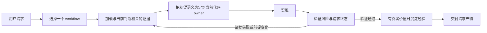

<p align="center">
  
</p>

<h1 align="center">Skill-Based Architecture</h1>

<p align="center"><strong>让你的 coding agent 真正按照项目规则、业务语义和完成标准工作。</strong></p>

<p align="center">
  SBA 把散落的 Agent 指令整理成一个可路由、可验证、可维护的项目 Skill。<br>
  SBA 是一个 Skill，不是 Agent 操作系统、任务数据库或执行 runtime。
</p>

<p align="center">
  <a href="#quick-start">快速开始</a> ·
  <a href="examples/simple-repo/README.md">安全体验</a> ·
  <a href="docs/sba-bible.md">阅读产品圣经</a>
</p>

<p align="center">
  <a href="https://github.com/WoJiSama/skill-based-architecture/stargazers">
    
  </a>
  <a href="https://github.com/WoJiSama/skill-based-architecture/forks">
    
  </a>
  <a href="LICENSE">
    
  </a>
</p>

<p align="center"><a href="README.md">English</a> | <strong>中文</strong></p>

大多数 coding agent 都能读取一份规则文件。真实项目需要的更多：规则散落在不同工具入口里，业务语义不等于当前代码，任务不同则所需上下文不同，而一条命令执行成功通常只是中间状态。

SBA 为 Agent 提供一份项目级执行契约。Agent 自己盘点仓库、选择一个 workflow、只加载会改变下一步判断的证据、把期望语义绑定到当前代码 owner、验证请求结果，并且只在经验确实会改变未来动作时进行沉淀。普通使用者只保留真正属于自己的决定：产品语义、业务规则、权限边界和高代价取舍。

## 使用 SBA 后有什么变化

| 没有 SBA | 使用 SBA |
|---|---|
| 同一条规则复制在 `AGENTS.md`、`CLAUDE.md`、Cursor rules 和 README 注记里 | 完整语义只有一个 owner；工具入口只保留到达 owner 所需的局部 hook |
| 每个任务都读取一份巨大的指令文件 | 一条 task route 先选择一个 workflow；之后只在未解决判断需要时加载知识 |
| Agent 根据请求关键词猜实现范围 | 用户确认语义和仓库证据会被翻译为当前代码 owner 与可执行 Change Contract |
| 命令、commit 或 push 成功就被当作“完成” | 完成判断只覆盖当前任务绑定的交付物和准确请求终态 |
| 经验不断堆成被动文档 | 已证明且可复用的失败会被回写到正确 owner，并接入下一次需要它的任务 |

## 什么时候适合使用

出现以下一种或多种真实压力时，SBA 开始有价值：

- 项目指令在多个 Agent 入口里重复、漂移或互相矛盾；
- 单个 `SKILL.md` 已经难以浏览和维护；
- 高频任务需要稳定流程、与风险匹配的验证或可靠完成检查；
- 高代价问题反复出现，因为经验虽然被记录，却从未在正确动作之前激活；
- 多个 harness 需要共享同一份项目知识，但团队不想维护多套规则系统。

小项目应该保持小。Quick Start 会根据目标仓库证据选择 `direct`、`folder` 或 `broad` 下游形态。证据表明需要更深分析时，仍可进入完整迁移 workflow；普通用户不需要选择 tier、profile、capability pack 或安装模式。

临时仓库、少于三份小型规则/文档文件的项目，或已经拥有紧凑可靠指令体系且不想迁移的团队，通常不需要 SBA。增长模型见 [Progressive Rigor](references/progressive-rigor.md)。

<a id="quick-start"></a>
## 快速开始

### 1. 让 Agent 能读取 SBA

**Claude Code：执行两条安装命令。**

```text
/plugin marketplace add WoJiSama/skill-based-architecture
/plugin install skill-based-architecture@skill-based-architecture
```

需要更新 marketplace 版本时执行 `/plugin marketplace update`。

**Cursor、Codex、Gemini、Windsurf、OpenCode 或其他能读取本地文件的 harness：把仓库 clone 到目标项目旁边。**

```bash
git clone https://github.com/WoJiSama/skill-based-architecture.git \
  ../skill-based-architecture
```

具体位置不是产品契约的一部分。Agent 只需要拥有读取权限；如果 harness 不能自动发现 Skill，就在请求里提供明确路径。工具入口的其他放置方式见 [Per-tool shells](references/per-tool-shells.md)。

### 2. 用普通语言说出结果

已经安装插件时：

> 使用 skill-based-architecture 整理这个项目的规则。

使用本地 clone 时：

> 先读取 `../skill-based-architecture/SKILL.md`，再用它整理这个项目的规则。

“整理项目规则”“把规则迁移到 skills 目录”“organize the project rules”等表达都会进入同一条迁移 workflow。

从这句话开始，工程工作由 Agent 承担：

1. 盘点现有指令入口，并读取理解项目所需的最小仓库证据；
2. 校准用户确认的产品或业务语义，同时把它与当前实现事实分开；
3. 根据证据推导 `direct`、`folder` 或 `broad` 物理形态及其 owner；只有证据需要更深分析时才进入完整迁移 workflow；
4. 写入前预览每一项 create、preserve 和 conflict 决策，再执行 apply 并完成保留指令的语义合并；
5. 同时验证生成结构，以及旧语义从 source 到 destination 的逐项证据。

只有仓库证据无法决定的真实产品/业务选择、权限边界或高代价取舍，才应该交给用户。

> **当前 materialize 边界：**[`scaffold-downstream.sh`](scripts/scaffold-downstream.sh) 会盘点目标项目、按证据推导 `direct`、`folder` 或 `broad` 结果，并且只创建证据纳入的 Skill owner、路由、检查和 harness 入口。它不向用户暴露 tier/profile/capability/安装模式开关。项目内容填充、既有入口合并，以及 source 到 destination 的语义证据，仍由 Agent 负责，完成迁移前不能省略。

### 不使用私有仓库也能体验

- 把 [`examples/simple-repo/`](examples/simple-repo/) 当作本地最小 fixture；其中故意放了互相重复的指令。
- Hosted 环境支持粘贴文件时，使用 [`COPY-PASTE-INPUT.md`](examples/simple-repo/COPY-PASTE-INPUT.md)。
- 通过 ClawMama [在 Telegram 或 WhatsApp 中运行 SBA](https://app.clawmama.run/skills/i78bb1/hermes?utm_source=github&utm_medium=issue&utm_campaign=skill_outreach_wojisama_skill_based_architecture)，进行轻量外部体验。不要上传敏感项目规则。

这个 fixture 只证明基础迁移和路由行为。它故意保持很小，不代表真实仓库迁移能够达到的最大深度。

## 一次真实任务如何运行



这是一条面向结果的生命周期，不是固定仪式。简单任务和只读任务会跳过不适用阶段。证据推翻当前前提时，Agent 应回到定位或拆解，而不是为了保持线性进度继续执行。

## 可靠性契约

| 能力 | SBA 对 Agent 的要求 |
|---|---|
| **看到足够完整的信息** | 区分用户意图、业务语义、架构契约、代码事实、运行证据和历史结论；当前判断解决后就停止扩读 |
| **在没有标准答案时做判断** | 明确取舍，比较真正不同的方案，只请求最小缺失规范性决定，并在证据变化时重排 Plan |
| **组织可靠执行** | 为 workflow、工具和可选执行者定义清楚的范围、输入、输出、禁止区和复核证据，同时由主 Agent 保留最终责任 |
| **完成准确请求** | 只证明当前请求、Task Anchor 和 governing Plan 绑定的交付物与终态；不把历史任务或相邻工作带入完成判断 |

这些是产品原则，不是“清单越长越可靠”的承诺。完整判断边界见 [SBA Bible](docs/sba-bible.md)。

## 用证据建立信任

| 边界 | 当前保障 |
|---|---|
| 写入之前 | Scaffold 默认只读预览，并报告每一项 `CREATE`、`PRESERVE` 和 `CONFLICT` 决策 |
| 现有项目语义 | 既有入口文件保持字节不变，直到 Agent 完成有证据支撑的语义合并 |
| Apply 失败 | 先在 staging 中生成；apply 失败时回滚本次新建路径 |
| 结构完整性 | `SKILL.md` 始终检查；routing、shell、workflow、Cursor、链接、reachability、orphan、预算和内容契约只对实际 materialize 的责任严格验收 |
| 迁移完整性 | 每条已盘点源指令都要有唯一 mapped/excluded disposition；逐字保留与 activation chain 可执行验证，faithful rewrite 则必须保留显式语义 review 证据 |
| 行为完整性 | 确定性全绿绝不冒充模型行为；独立 opt-in live Codex journeys 分别验证 fresh-project Single-file 任务和普通 SBA 迁移，并把外部不可用单独报告 |
| 交付完整性 | 本地改动不等于 commit，commit 不等于 push，已 push 的分支不等于 MR/PR，已 approval 的 MR/PR 不等于 merge |

结构检查不能证明每一条旧规则都完成了语义迁移。迁移证据门可以证明 inventory 覆盖、逐字保留和 activation-chain 完整性，但 faithful rewrite 的等价性仍由已记录的语义 review 负责。真实 Agent 行为又是独立的一层证明。SBA 会分开这些结论，不让一个绿色汇总替代判断。

<details>
<summary>当前 scaffold 与验证命令</summary>

```bash
UPSTREAM="${UPSTREAM:-../skill-based-architecture}"
NAME="<project-name>"
SUMMARY="<one-line project summary>"

# 只读路径预览。
bash "$UPSTREAM/scripts/scaffold-downstream.sh" \
  --target "$PWD" --name "$NAME" --summary "$SUMMARY"

# Agent 审核 inventory 和项目证据后再 apply。
bash "$UPSTREAM/scripts/scaffold-downstream.sh" \
  --target "$PWD" --name "$NAME" --summary "$SUMMARY" --apply

# 只运行 materializer 实际生成的 fitted checks。
if [[ -f "skills/$NAME/scripts/smoke-test.sh" ]]; then
  bash "skills/$NAME/scripts/smoke-test.sh" "$NAME"
fi
if [[ -f "skills/$NAME/routing.yaml" && -f "skills/$NAME/scripts/sync-routing.sh" ]]; then
  bash "skills/$NAME/scripts/sync-routing.sh" "$NAME" --check
fi
for check in audit-orphans route-reachability route-health; do
  if [[ -f "skills/$NAME/scripts/$check.sh" ]]; then
    (cd "skills/$NAME" && bash "scripts/$check.sh")
  fi
done
```

占位符处理、语义迁移和检查结果解释由 Agent 负责，不由普通用户负责。需要机器化证明 source disposition 时，Agent 还会运行会话内的 migration-evidence checker；临时 manifest 不会变成下游 ledger。完整流程见 [WORKFLOW.md](WORKFLOW.md)。

</details>

## Harness 兼容

SBA 使用当前 harness 已有的 Plan、工具和可选委派能力。能力缺失只改变执行方式，不改变项目契约。

| Harness 类型 | 常见发现或入口方式 |
|---|---|
| **Claude Code** | Marketplace plugin 或 `CLAUDE.md`；可选原生 Skill 注册 |
| **Cursor** | `.cursor/skills/<name>/SKILL.md` 加 `.cursor/rules/*.mdc` |
| **Codex、Copilot CLI、OpenCode 和其他 AGENTS.md reader** | `AGENTS.md` |
| **Windsurf** | 共享 `AGENTS.md` 或 `.windsurf/rules/*.md` |
| **Gemini CLI** | `GEMINI.md` |

发现方式与优先级细节见 [Per-tool shells](references/per-tool-shells.md)。

## FAQ

**需要 sub-agent 吗？**

不需要。Sub-agent 是可选加速器，不是安装或正常使用的前置条件。若委派不可用，Agent 会 inline 执行同一份有界工作。正确性和完成标准不依赖 sub-agent 是否可用。若 harness 要求显式委派权限，不授权只会改变执行方式，不会改变请求结果。不能静默跳过 workflow 或弱化验证。

**什么才算真正完成？**

只有当前任务绑定的交付物和请求终态进入完成判断。历史任务、相邻仓库和隐含后续流程，除非用户、Task Anchor 或 governing Plan 明确纳入，否则都在完成范围之外。任何中间状态都不能冒充请求终态。

**SBA 会替代官方最小 Skill 规范吗？**

不会。小型 Skill 可以继续只使用一份带标准 frontmatter 的 `SKILL.md`。只有 routing、重复 workflow、reference、跨 harness 入口、验证或维护压力超出这种形态时，SBA 才开始发挥价值。

**下游项目怎样获得上游改进？**

让 Agent 执行 update from upstream。下游更新 workflow 会比较最新上游机制与项目自有内容，只应用相关变更，保留本地知识并重新执行与风险匹配的验证。见 [更新已有下游项目](WORKFLOW.md#upgrading-an-existing-downstream-project)。

**Quick Start 如何选择物理形态？**

它会读取指令入口、重复任务信号、harness 声明和维护压力，再推导 `direct`、`folder` 或 `broad` 结果。证据足够时，broad 结果可以纳入该项目真正需要的完整运行 owner；较小结果不会带入无关的作者机制。选择留在 materializer 内部，用户不需要管理形态或重新安装 capability pack。

## 深入了解

| 需求 | 从这里开始 |
|---|---|
| 迁移一个仓库 | [WORKFLOW.md](WORKFLOW.md) |
| 理解产品边界 | [SBA Bible](docs/sba-bible.md) |
| 理解 router 和核心原则 | [SKILL.md](SKILL.md) |
| 查看迁移与行为示例 | [EXAMPLES.md](EXAMPLES.md) 和 [`examples/`](examples/) |
| 使用或维护模板 | [TEMPLATES-GUIDE.md](TEMPLATES-GUIDE.md) 和 [`templates/`](templates/) |
| 理解验证覆盖范围 | [scripts/README.md](scripts/README.md) |
| 阅读架构参考 | [REFERENCE.md](REFERENCE.md) 和 [`references/`](references/) |
| 跟踪上游变化 | [UPSTREAM-CHANGES.md](UPSTREAM-CHANGES.md) |

## 项目状态

当前产品已经提供按证据选择的 `direct`/`folder`/`broad` materialize、安全 preview/apply/rollback、Agent 主导的语义迁移、责任感知的结构验证、可执行的源指令 disposition 与 activation 证据、可路由任务 workflow、与实际 owner 匹配的 conformance、完成纪律和上游更新路径。后续维护应继续提升证据质量和 fitted proof，但不能把形态、tier 或 capability 决策转嫁给普通用户。

许可证：[LICENSE](LICENSE)。社区讨论：[LinuxDO](https://linux.do/)。

## Star History

<a href="https://www.star-history.com/?repos=WoJiSama%2Fskill-based-architecture&type=date&legend=top-left">
 <picture>
   <source media="(prefers-color-scheme: dark)" srcset="https://api.star-history.com/chart?repos=WoJiSama/skill-based-architecture&type=date&theme=dark&legend=top-left&sealed_token=_50ppLd8ZCf0pa-el1_zEvHrjWgcS2xcR6EPDrKTOD-tgps6UDfYTFrO24oUfghoFgtqg_DjmmBKiya5MiZZrmZYuzWs4kTUFZK-7M3FD6LSPExvB6uZBbIfCE_wWmfKNExXOK55_IhwO7Nz_MmCe4ctHZQ7nDTkEGFi7ScaLbqt2aN9N4RAg3YMVyAa" />
   <source media="(prefers-color-scheme: light)" srcset="https://api.star-history.com/chart?repos=WoJiSama/skill-based-architecture&type=date&legend=top-left&sealed_token=_50ppLd8ZCf0pa-el1_zEvHrjWgcS2xcR6EPDrKTOD-tgps6UDfYTFrO24oUfghoFgtqg_DjmmBKiya5MiZZrmZYuzWs4kTUFZK-7M3FD6LSPExvB6uZBbIfCE_wWmfKNExXOK55_IhwO7Nz_MmCe4ctHZQ7nDTkEGFi7ScaLbqt2aN9N4RAg3YMVyAa" />
   
 </picture>
</a>
